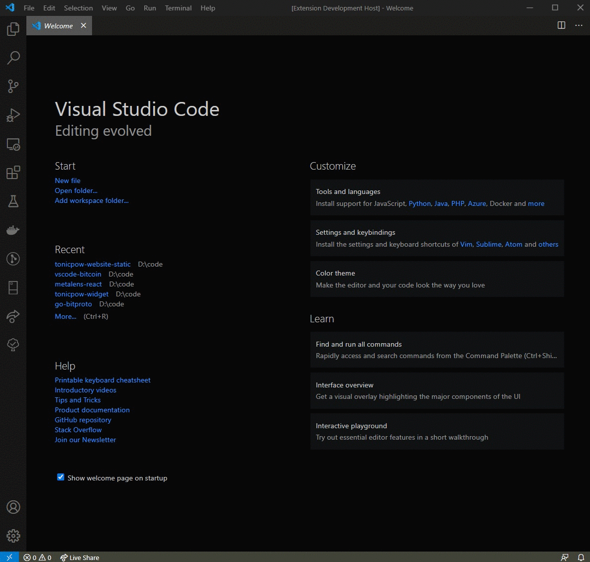
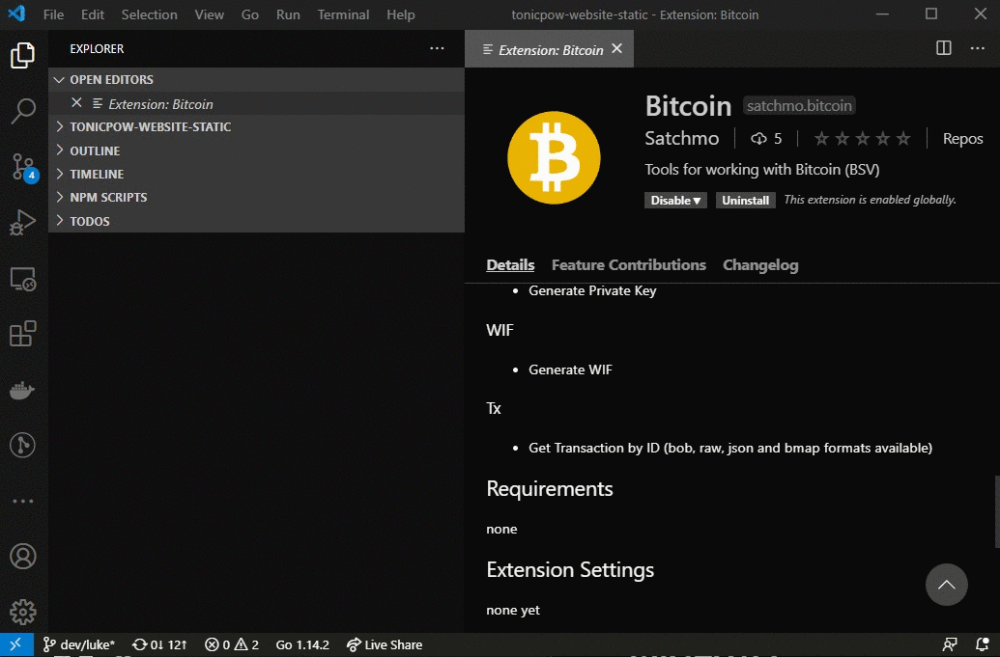

# bitcoin README

This extention provides convenience functions for working with Bitcoin addresses, transactions, and keys.

## Features

### Address

- Address from Private Key
- Address from Public Key
- Address from WIF
- Derive Address from Extended Public Key
- Derive Address from Extended Private Key

### Public Key

- Public Key from Private Key
- Generate Public Key

### Mnemonic

- Generate Mnemonic

### Extended (HD) Keys

- Generate Extended Public Key
- Extended Public Key from Extended Private Key
- Extended Private Key From Mnemonic

### Private

- Generate Private Key

### WIF

- Generate WIF

### Tx

- Get Transaction by ID (bob, raw, json and bmap formats available)
- Decode Raw Transaction
- Raw Transaction to Bob
- Raw Transaction to Txo

### Utxo

- Get UTXOs for Address

## Requirements

none

## Extension Settings

none yet

## Known Issues

none

## Release Notes

Users appreciate release notes as you update your extension.

---

### For more information

- [Bmap](http://bmapjs.com)
- [Bitcoin SV](https://bitcoinsv.com/)

### Network Dependencies

- [Whats on chain](https://whatsonchain.com)

### Lib dependencies

- [Shapeshifter](https://github.com/libitx/shapeshifter.js)
  **Enjoy!**
