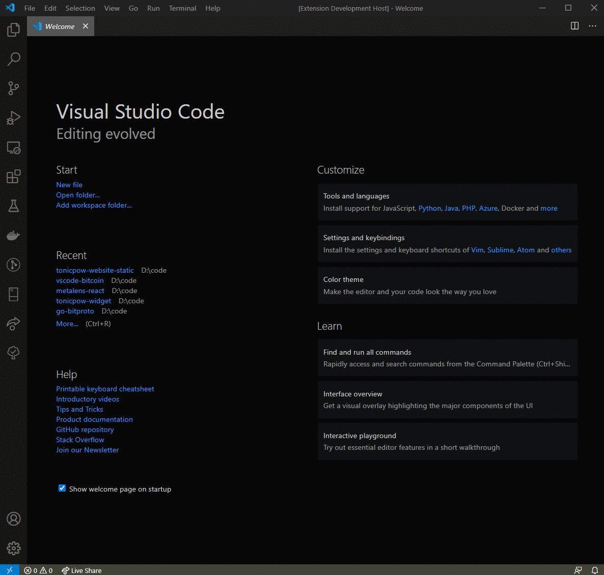
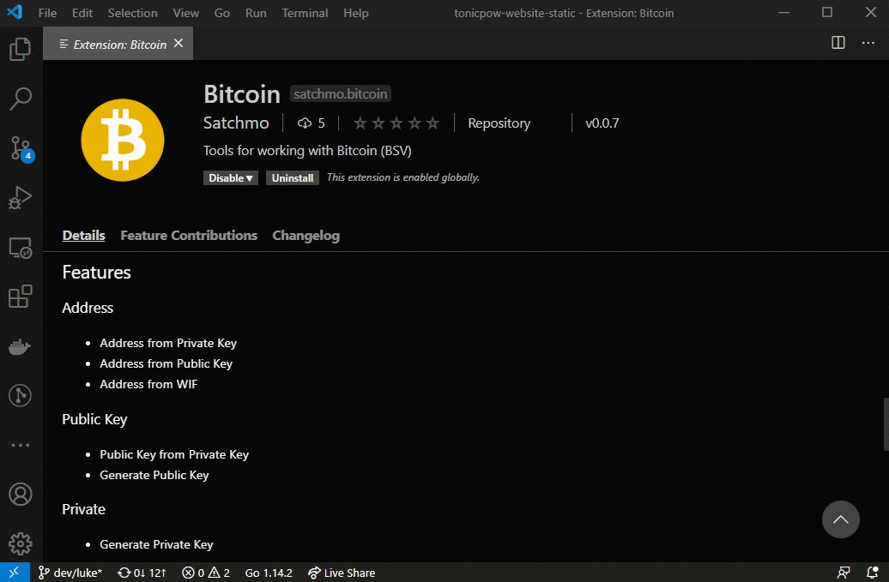
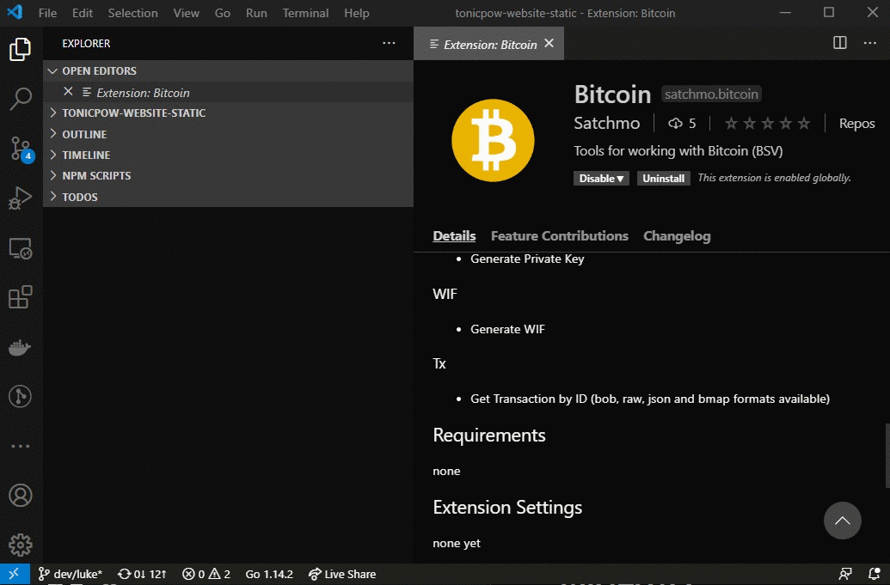
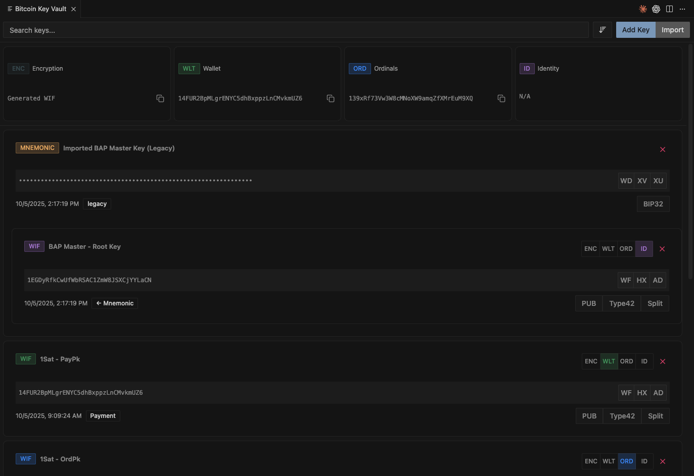

# Bitcoin VS Code Extension

This extension provides convenient tools for working with Bitcoin (BSV) addresses, transactions, and keys using the modern `@bsv/sdk` library.







## Features

### Address Operations
- Generate address from private key
- Generate address from public key
- Generate address from WIF
- Derive address from HD public key (xpub)
- Derive address from HD private key (xprv)

### Key Management
- Generate private key
- Generate public key from private key
- Generate WIF format key
- Generate HD public key (xpub)
- Generate HD private key (xprv)
- Derive HD public key from HD private key
- Generate mnemonic phrase
- Generate HD private key from mnemonic

### Script Operations
- Convert script to ASM format
- Parse and decode scripts
- Work with P2PKH scripts

### Transaction Operations
- Fetch transaction by ID (supports multiple formats):
  - Raw format
  - BOB format
  - BMAP format
  - JSON format
- Decode raw transactions
- Convert raw transaction to BOB format

### UTXO Management
- Fetch UTXOs for any address

### Data Conversion
- Convert between different data formats:
  - UTF-8 text
  - Hex
  - Base64
  - Binary Array
- Advanced Conversion Tool with:
  - Format auto-detection
  - Live preview
  - Copy to clipboard
  - Support for all formats
  - Input validation
- Detect and convert content types (images, etc.)

The Advanced Conversion Tool can be accessed in three ways:
1. From the Command Palette: "Bitcoin: Open Conversion Tool"
2. From the Welcome Screen: Click "Advanced Conversion Tool" under Data Conversion
3. From the context menu: Right-click on selected text and choose "Bitcoin > Open Conversion Tool"

Features of the Advanced Conversion Tool:
- **Format Auto-detection**: Automatically detects the format of your input
- **Live Preview**: See the converted output immediately
- **Copy Button**: One-click copy of the converted result
- **Input Validation**: Validates input format before conversion
- **Multiple Formats**: Convert between UTF-8, hex, base64, and binary array
- **Error Handling**: Clear error messages for invalid inputs
- **VS Code Theme Integration**: Matches your VS Code theme

### Output Management
Each command's output can be configured to:
- Copy to clipboard (default)
- Open in a new text file
- Save to workspace folder

The workspace folder (`.bitcoin` by default) organizes outputs into categories:
```
.bitcoin/
├─ addresses/      # Generated addresses
├─ conversions/    # Format conversion results
├─ keys/          # Generated keys (no private data)
├─ media/         # Converted images and binary content
├─ scripts/       # Script operations output
├─ transactions/  # Transaction data
└─ utxos/         # UTXO lists
```

Configure these preferences in VS Code settings under "Bitcoin Extension":
```json
{
  "bitcoin.outputPreference": {
    "convertData": "workspace",    // "clipboard", "file", or "workspace"
    // ... settings for each command
  },
  "bitcoin.workspace": {
    "path": ".bitcoin",           // Workspace folder path
    "detectContentType": true,    // Auto-detect binary content types
    "organizeFolders": true       // Use category subfolders
  }
}
```

### Workspace Management
The extension now includes a dedicated workspace for managing Bitcoin-related files. By default, it creates a `.bitcoin` directory in your workspace root where it organizes:

- Transaction data
- Keys and addresses
- Media files (images, documents)
- Other Bitcoin-related content

Files are automatically organized into subfolders by type and named using appropriate identifiers (e.g., transaction IDs) to maintain a clean workspace structure.

### Content Detection and Conversion
The extension can automatically detect and convert various types of content:

- Base64-encoded data
- Images (JPEG, PNG)
- JSON data
- XML documents
- Other binary formats

When content type cannot be automatically detected, the extension will prompt you to specify the format.

### Output Options
You can configure how the extension handles command output:

- **Clipboard**: Copy results to clipboard (default)
- **File Dialog**: Save to a location of your choice
- **Workspace**: Automatically save in the `.bitcoin` workspace

## Configuration

### Workspace Settings
```json
{
  "bitcoin.workspace.path": ".bitcoin",
  "bitcoin.workspace.detectContentType": true,
  "bitcoin.workspace.organizeFolders": true,
  "bitcoin.outputPreference": "clipboard"
}
```

- `workspace.path`: Path to the Bitcoin workspace directory (relative to workspace root)
- `workspace.detectContentType`: Automatically detect content types when saving files
- `workspace.organizeFolders`: Organize files into subfolders by type
- `outputPreference`: Where to output results (clipboard, file dialog, or workspace)

## Requirements

- VS Code version 1.93.0 or higher
- No other special requirements. The extension includes all necessary dependencies.

## Installation

1. Install from VS Code marketplace
2. Or build from source:
   ```bash
   git clone https://github.com/rohenaz/vscode-bitcoin.git
   cd vscode-bitcoin
   bun install
   bun run build
   ```

## Development

### Build Commands
- `bun run build` - Build the extension using Vite
- `bun run dev` - Build in watch mode
- `bun run test` - Run test suite
- `bun run package` - Package for distribution
- `bun run clean` - Clean build artifacts
- `bun run lint` - Run linter
- `bun run format` - Format code

### Testing
Tests are written using Bun's test runner with BDD style. Run tests with:
```bash
bun test
```

## Dependencies

### Core Libraries
- [@bsv/sdk](https://github.com/bitcoin-sv/bsv-sdk) - Modern Bitcoin SV development kit
- [bpu-ts](https://github.com/rohenaz/bpu-ts) - Bitcoin Protocol Parser in TypeScript
- [bmapjs](https://github.com/rohenaz/bmapjs) - Bitcoin Metadata Application Protocol

### Network Services
- [WhatsOnChain](https://whatsonchain.com) - API for UTXOs and transaction data

## Changelog

See [CHANGELOG.md](CHANGELOG.md) for a detailed list of changes.

## Contributing

1. Fork the repository
2. Create your feature branch
3. Write tests for your changes
4. Commit your changes
5. Push to the branch
6. Create a Pull Request

## License

[MIT License](LICENSE)

## Resources

- [BSV Academy](https://bitcoinsv.academy/)
- [Bitcoin SV](https://bitcoinsv.com/)
- [WhatsOnChain](https://whatsonchain.com)
- [BMAP](http://bmapjs.com)

**Enjoy!**

### Secure Key Management
The extension includes a secure key vault for managing sensitive cryptographic keys:

- **Encrypted Storage**: Keys are stored in VS Code's secure storage, not in the workspace
- **Key Types**: Supports private keys, public keys, WIF, HD keys, and mnemonics
- **Search & Filter**: Quickly find keys by type, label, or content
- **Secure Copying**: Copy keys to clipboard without saving to disk
- **Key Organization**: View all keys in a searchable table with type indicators
- **Automatic Storage**: Generated keys are automatically saved to the vault
- **Easy Cleanup**: Delete individual keys or clear all stored keys

To access the key vault:
1. Open Command Palette (`Ctrl+Shift+P` / `Cmd+Shift+P`)
2. Type "Bitcoin: Show Key Vault"



The key vault provides:
- Color-coded badges for different key types
- Truncated key display for security
- One-click copy to clipboard
- Creation timestamps
- Search functionality
- Bulk deletion option

### Security Features
- Keys are stored in VS Code's encrypted storage
- Keys never touch the disk unless explicitly exported
- Automatic `.gitignore` management for `.bitcoin` workspace
- Warning if `.bitcoin` workspace isn't git-ignored
- Secure clipboard operations for sensitive data
