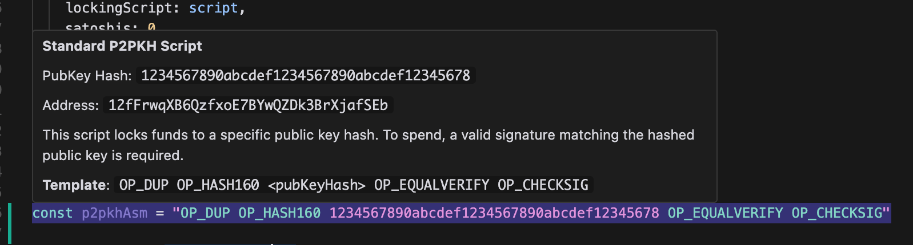

# Bitcoin VS Code Extension

A powerful Bitcoin development toolkit for VS Code, built on the modern `@bsv/sdk` library.


## Features

### Key Management
- Generate and manage private/public keys
- Support for WIF format keys
- HD key generation and derivation (xpub/xpriv)
- Mnemonic phrase generation
- Secure key vault with encrypted storage
- Color-coded key organization
- One-click key operations


### Address Operations
- Generate addresses from various key formats
- HD address derivation
- UTXO management
- WhatsOnChain explorer integration
- BAP profile lookup

### Script Operations
- Script to ASM conversion
- P2PKH script support
- Rich syntax highlighting:
  - Bitcoin opcodes with hover descriptions
  - P2PKH scripts with address derivation
  - Bitcoin addresses with explorer links
  - Transaction IDs with explorer links



### Transaction Operations
- Transaction fetching and decoding
- Multiple output formats:
  - Raw format
  - BOB format
  - BMAP format
  - JSON format

### Data Conversion
- Advanced conversion tool with:
  - Format auto-detection
  - Live preview
  - Copy to clipboard
  - Input validation
  - VS Code theme integration
- Support for:
  - Hex format
  - Base64
  - Binary data
  - UTF-8 text

### Ordinals & Inscriptions
- Fetch and view inscriptions
- Parse inscription metadata
- Support for various content types

### Security
- Encrypted key storage
- Secure clipboard operations
- Protected workspace
- Automatic `.gitignore` management

### Workspace Management
The extension creates a `.bitcoin` directory to organize:
```
.bitcoin/
├─ addresses/      # Generated addresses
├─ conversions/    # Format conversion results
├─ keys/          # Generated keys (no private data)
├─ media/         # Converted images and binary content
├─ scripts/       # Script operations output
├─ transactions/  # Transaction data
├─ encrypted/     # Encrypted files
└─ utxos/         # UTXO lists
```

## Configuration

### Settings
```json
{
  "bitcoin.workspace.path": ".bitcoin",
  "bitcoin.workspace.detectContentType": true,
  "bitcoin.workspace.organizeFolders": true,
  "bitcoin.outputPreference": "clipboard",
  "bitcoin.bapIndexerUrl": "https://bap.network/api/v1"
}
```

### Output Options
- **Clipboard**: Copy to clipboard (default)
- **File**: Save via file dialog
- **Workspace**: Auto-save to `.bitcoin` workspace

## Development

### Build Commands
- `bun run build` - Build the extension
- `bun run dev` - Build in watch mode
- `bun run test` - Run test suite
- `bun run package` - Package for distribution
- `bun run clean` - Clean build artifacts
- `bun run lint` - Run linter
- `bun run format` - Format code

### Testing
Tests use Bun's test runner with BDD style:
```bash
bun test
```

## Dependencies

### Core Libraries
- [@bsv/sdk](https://github.com/bitcoin-sv/bsv-sdk) - Modern Bitcoin SV development kit
- [bpu-ts](https://github.com/rohenaz/bpu-ts) - Bitcoin Protocol Parser in TypeScript
- [bmapjs](https://github.com/rohenaz/bmapjs) - Bitcoin Metadata Application Protocol

### Network Services
- [WhatsOnChain](https://whatsonchain.com) - API for UTXOs and transaction data
- [BAP Network](https://bap.network) - BAP profile indexer

## Contributing

1. Fork the repository
2. Create your feature branch
3. Write tests for your changes
4. Commit your changes
5. Push to the branch
6. Create a Pull Request

## License

[MIT License](LICENSE)

## Resources

- [BSV Academy](https://bitcoinsv.academy/)
- [Bitcoin SV](https://bitcoinsv.com/)
- [WhatsOnChain](https://whatsonchain.com)
- [BMAP](http://bmapjs.com)
- [BAP Network](https://bap.network)

**Enjoy!**

